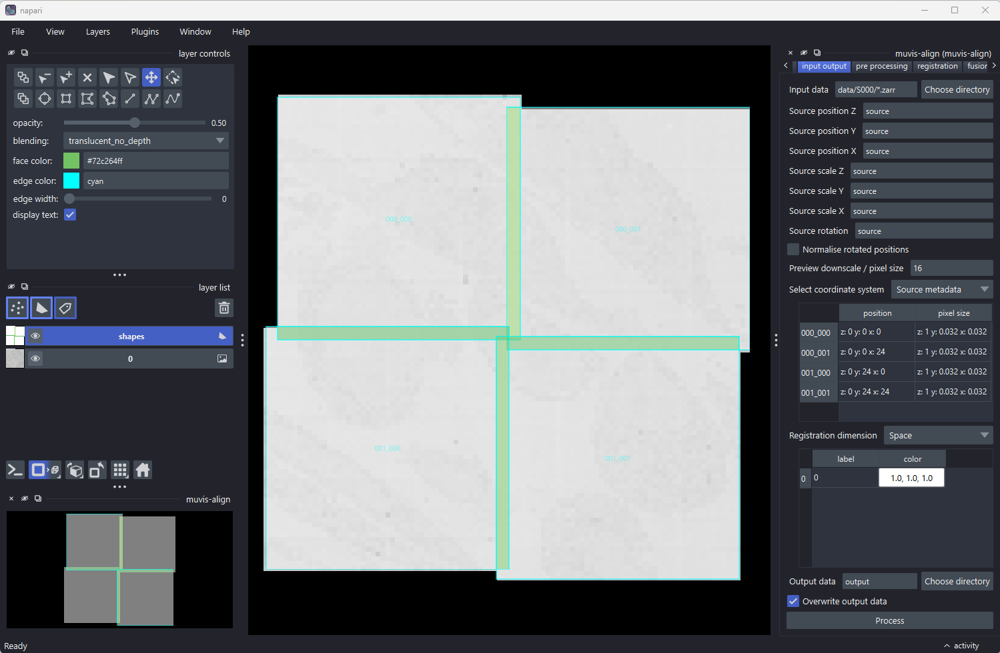
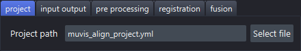
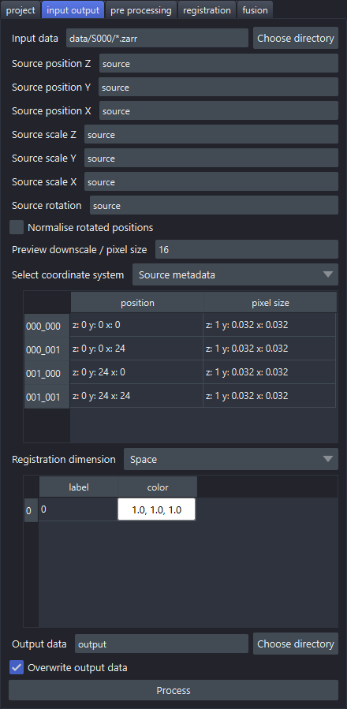
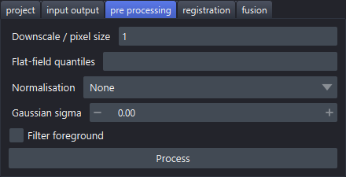
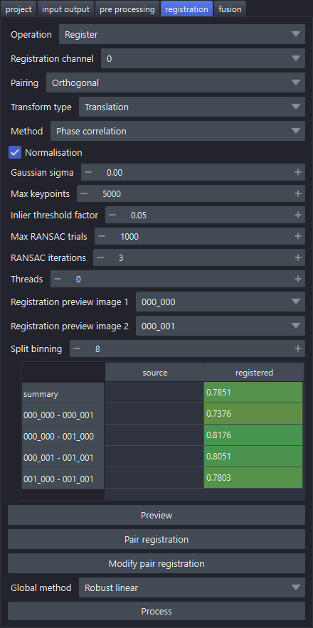
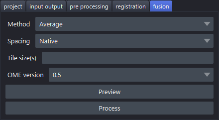

# Step by step in napari

A walk through the plugin, one tab at a time: every parameter on it, and what each of its
buttons does. The screenshots are of a 2×2 tile set (`data/S000/*.zarr` in this repository),
taken after registering it. For how the plugin stores its settings, see
[the napari plugin](napari.md).

## Opening the plugin

Start napari and open **Plugins → muvis-align**.

- **On the right**, the plugin itself: one tab per step, run from left to right.
- **At the bottom left**, the **muvis-align** overview: a small map of where the sources are,
  which stays put while you zoom into the main view.
- **In the main view**, the sources at their positions, with each overlap between two
  sources drawn as a green shape.

A tab is enabled once the step before it has run: at the start only **project** is.
Each tab ends in a **Process** button that runs its step. While a step runs, the plugin's
other widgets are disabled, the button reads **Cancel** (it asks before cancelling, and the
partial result is discarded), and its progress shows in napari's **activity** panel at the
bottom right.

Hover over any parameter to see its description.

## 1. Project

| Parameter | Description |
|-----------|-------------|
| Project path | The project file (`muvis_align_project.yml` by default) |

**Select file** chooses an existing project file, or names a new one. An existing project
opens with its settings in every tab; a new one is created with the defaults. Either way
the next tabs are enabled. Every change on any tab is written straight back to this file,
so the project reopens as you left it.

## 2. Input output

| Parameter | Description |
|-----------|-------------|
| Input data | The sources: a file, a folder or a wildcard pattern such as `data/*/*.tiff` (TIFF, OME-TIFF, Zarr, OME-Zarr) |
| Source position Z / Y / X | Where each source's position comes from: `source` reads it from the file's metadata, or an expression over the file name, such as `fn[-2]*24` (the second-last number in the name, times 24) |
| Source scale Z / Y / X | The pixel size, in the same way: `source`, a number, or an expression |
| Source rotation | The rotation, in the same way |
| Normalise rotated positions | Turn a rotated layout straight: positions are turned back by the sources' rotation, or by the tile grid's own angle where the metadata gives none |
| Preview downscale / pixel size | Resolution of the view: a downscale factor (e.g. `16`) or a pixel size with unit (e.g. `10um`) |
| Select coordinate system | Which positions the metadata table shows: the sources' own (**Source metadata**), or the registered ones once there are any |
| Metadata table | Read-only: each source's position and pixel size, ordered by (z, y, x) position |
| Registration dimension | What the sources are spread over: **Space** (tiles side by side), **Z** (a stack of slices), **C** (channels of the same field) or **T** (time points) |
| Channels table | Each channel's label and colour; click a colour cell to pick a colour |
| Output data | The output folder, relative to the project file |
| Overwrite output data | Overwrite any existing output |

**Process** reads the sources' metadata and draws their layout in the view and the overview,
without reading the image data in full. If the output folder holds a registration from an
earlier run, it is loaded too, and the plugin carries on from where that run stopped. If
that registration was made with different source position, scale or rotation settings, the
plugin asks whether to **Reload** those settings or **Discard** the earlier output.

## 3. Pre processing

These apply to the images used for registration only: the fused output is made from the
original sources.

| Parameter | Description |
|-----------|-------------|
| Downscale / pixel size | Resolution to register at: a downscale factor (e.g. `2`) or a pixel size with unit (e.g. `10um`). Usually the largest single speed-up |
| Flat-field quantiles | One or two quantiles for flat-field correction, e.g. `0.5` or `0.01,0.99`; empty for none |
| Normalisation | **Single** (each tile on its own), **Global** (over all tiles) or **None** |
| Gaussian sigma | Gaussian blur before registration; 0 or empty for none |
| Filter foreground | Leave out tiles with little image signal, such as empty tiles |

**Process** pre-processes the sources and shows the result in the view, then moves on to the
registration tab. Running it is optional: registration pre-processes the sources itself
when they have not been yet. Running it again after a registration makes that registration
out of date, as it was made from the previous images.

## 4. Registration

Choose the **Operation** first, as it decides what the rest of the run does:

- **Register**: register the sources, then fuse them on the fusion tab.
- **Merge**: fuse the sources at their metadata positions, without registering. **Process**
  only moves on to the fusion tab. The output is named `merged` rather than `registered`.
- **Convert**: write each source out as its own OME-Zarr at its metadata position, with
  no registration and no fusion. Each source keeps its own pyramid levels; nothing is
  resampled. **Process** writes them to a `converted/` output folder. Worth doing first
  for sources without a pyramid, which make every preview slow.

| Parameter | Description |
|-----------|-------------|
| Operation | **Register**, **Merge** or **Convert**, as above |
| Registration channel | The channel to register on |
| Pairing | Which sources are registered against each other: **Default** (multiview-stitcher's own), **Orthogonal** (leaves out diagonal and very small overlaps), **Stack** (consecutive sources) or **Split: 2D x/y first** (each plane's or channel's tiles first, then the stitched planes or channels against each other) |
| Transform type | **Translation**, **Rigid**, **Affine** or **Similarity** |
| Method | Pairwise registration: **Phase correlation**, **SIFT**, **ORB**, **CPD**, **Elastix** or **ANTs** |
| Normalisation | Normalise each overlap before registering it |
| Gaussian sigma | Gaussian blur of each overlap; 0 or empty for none |
| Max keypoints | Feature methods (SIFT, ORB): the most keypoints per image |
| Inlier threshold factor | Feature methods: RANSAC's inlier threshold, relative (0 to 1) |
| Max RANSAC trials | Feature methods: the most RANSAC trials |
| RANSAC iterations | Feature methods: the number of RANSAC runs |
| Threads | Pair registrations run in parallel; 0 or empty to choose automatically |
| Registration preview image 1 / 2 | The pair that **Preview** and **Modify pair registration** work on |
| Split binning | Split pairing only: the binning of the stitched planes or channels when registering them against each other (1 is the pre-processed pixel size) |
| Metrics table | Read-only: each pair's registration quality, from source positions and once registered, ordered by position. The summary row is over all pairs |
| Global method | How the pair registrations are resolved into one position per source: **Robust linear** (fast, for large projects, translation or rigid only), **Global optimisation** (iterative, slow for many tiles), **Linear two-pass** (fastest, less robust to bad pairs) or **Shortest paths** |

The buttons:

- **Preview** registers just the selected pair and shows the two overlaps with their matches,
  with the pair's metrics in the table. Much faster than a full run while trying out
  parameters. To choose the pair, use the two dropdowns, click an overlap shape in the view,
  or click a pair's row in the metrics table.
- **Pair registration** registers every pair.
- **Modify pair registration** shows the selected pair in green and purple, to move one onto
  the other by hand with napari's transform tools. The pair's metrics follow the change,
  and the rest of the plugin is disabled meanwhile. Press it again to finish: it asks
  whether to store the change, which then replaces that pair's registration.
- **Process** runs the global registration, which resolves the pair registrations into a
  position for each source, and shows the registered layout. It runs pair registration
  first if that has not been done. It saves the result in the output folder:
  `pair_mappings.json`, `mappings.json` and `mappings.csv` (the transforms), `metrics.json`,
  and an RO-Crate (`ro-crate-metadata.json`) describing the run.

## 5. Fusion

| Parameter | Description |
|-----------|-------------|
| Method | How overlapping sources combine: **Average**, **Exclusive**, **Additive** or **Compose** |
| Spacing | Output pixel size: **Native** (each level at the sources' own pixel sizes, never upsampled), **Mean**, **Min** (highest resolution) or **Max** (lowest resolution) |
| Tile size(s) | Tile size of the output, e.g. `1024` or `1024,1024,1024`; empty to size it by available memory. For OME-Zarr this is also how the fusion is split into blocks, so a small size costs time. See [Tile size](pipeline.md#tile-size) |
| OME version | OME-Zarr version to write: **0.4**, **0.5** or **0.6** |

The buttons:

- **Preview** fuses at the view's resolution and shows the result, which stays quick for a
  large dataset.
- **Process** exports the full-resolution fusion to the output folder, as `registered`
  (or `merged`). It first asks to confirm, with an estimate of the output size, and runs
  any registration still missing. It also writes an RO-Crate inside the OME-Zarr describing
  the acquisition, and updates the one in the output folder.
